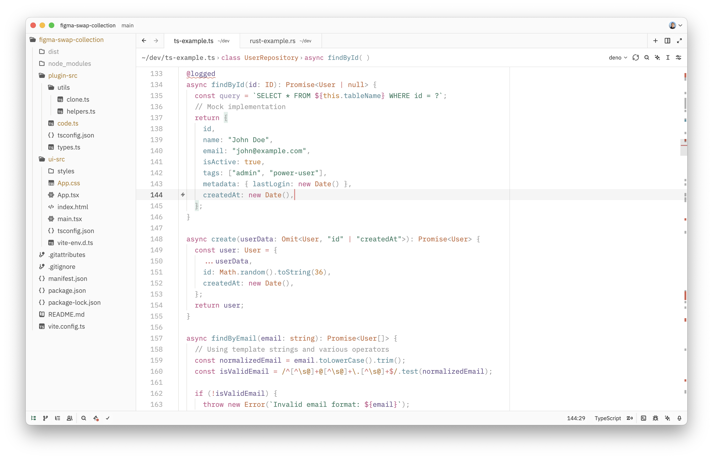
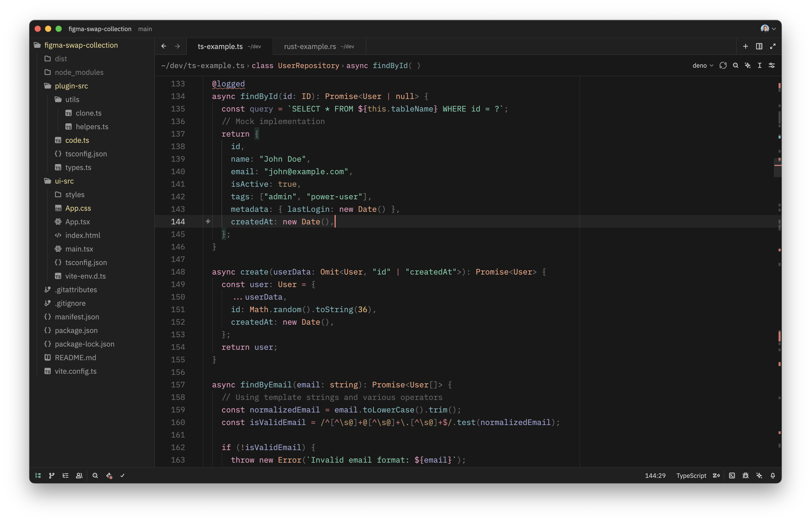

<p align="center">
    <picture>
      <source media="(prefers-color-scheme: dark)" srcset="./.github/logo-dark.svg">
      <source media="(prefers-color-scheme: light)" srcset="./.github/logo-light.svg">
      
    </picture>
</p>

Zoegi is a theme for [Zed](https://zed.dev).

It's based on the beautiful [Moegi theme for VS Code](https://github.com/moegi-design/vscode-theme) created by [Diu](https://github.com/ddiu8081).

## Preview

Zoegi currently includes light and dark variants.

### Zoegi Light


### Zoegi Dark


## How to install

### Extension Gallery

1. Launch the Zed Extension Gallery by pressing `⌘⇧X`, opening the command palette and selecting `zed: extensions` or by selecting "Zed > Extensions" from the menu bar.
2. Search for "Zoegi Theme" and click "Install"

### Manual installation

Drop `zoegi.json` into the `themes/` subdirectory inside the Zed config:

```
~/.config/zed/themes/
```
