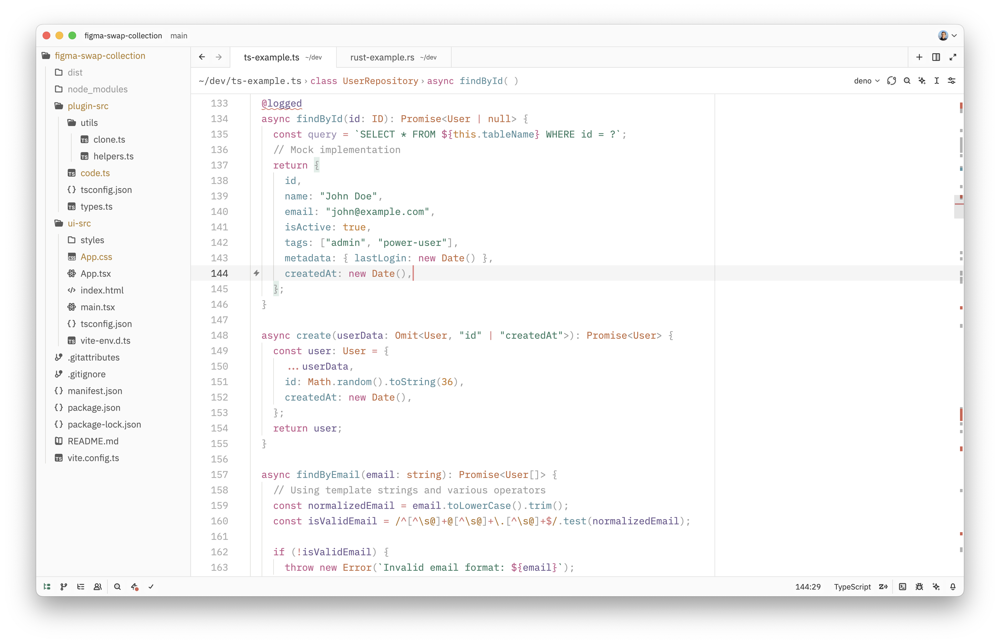
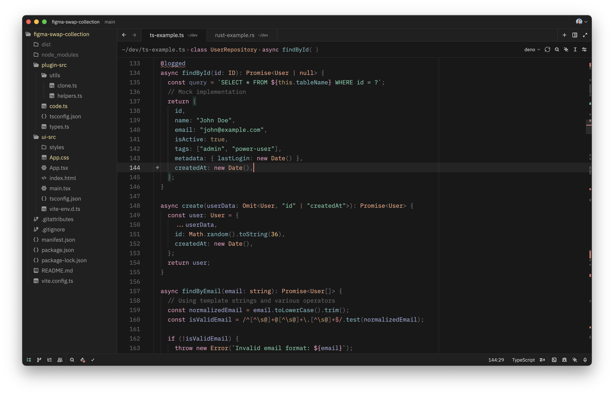

# Zoegi Theme

Zoegi is a theme for [Zed](https://zed.dev).

It's based on the beautiful [Moegi theme for VS Code](https://github.com/moegi-design/vscode-theme) created by [Diu](https://github.com/ddiu8081).

## Preview

Zoegi currently includes two variants: light and dark.

### Zoegi Light


### Zoegi Dark


## How to install

Drop `zoegi.json` into the `themes/` subdirectory inside the Zed config:

```
~/.config/zed/themes/
```
