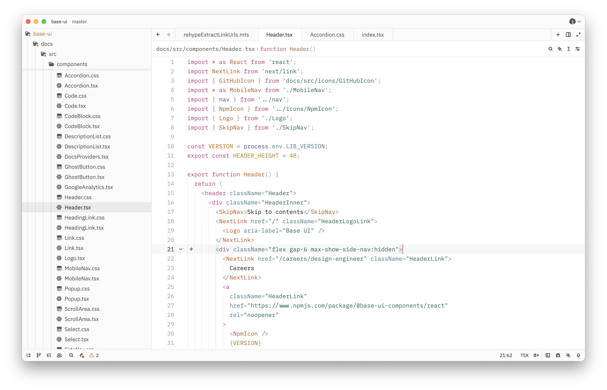
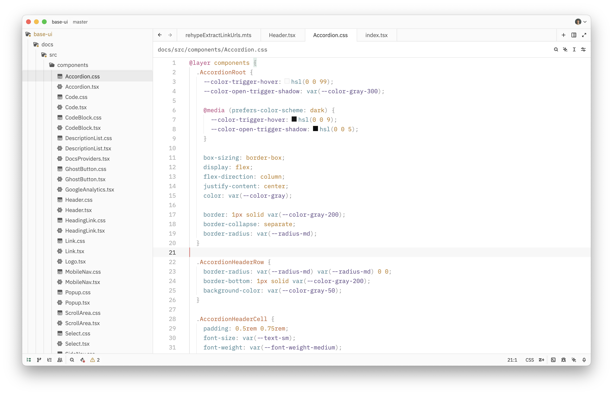
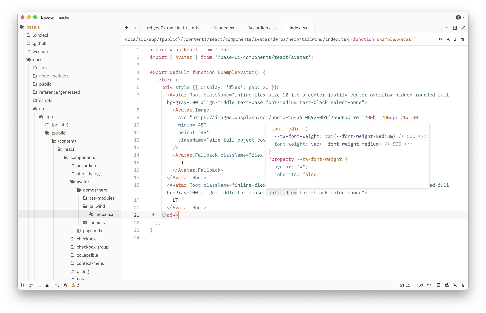
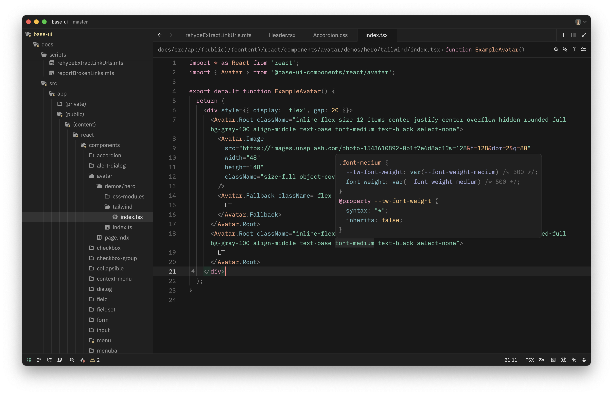

<br>

<p align="center">
    <picture>
      <source media="(prefers-color-scheme: dark)" srcset="./.github/logo-dark.svg">
      <source media="(prefers-color-scheme: light)" srcset="./.github/logo-light.svg">
      
    </picture>
</p>


<p align="center">
    A charming and practical theme for Zed.
</p>

<br>

# Zoegi Theme

Zoegi is a pleasing and refined theme for [Zed](https://zed.dev). It's based on the beautiful [Moegi theme for VS Code](https://github.com/moegi-design/vscode-theme) created by [Diu](https://github.com/ddiu8081).

## Preview

Zoegi currently includes light and dark variants.

### Zoegi Light

**TypeScript**


<details>
<summary><strong>React</strong></summary>

</details>

<details>
<summary><strong>CSS</strong></summary>

</details>

<details>
<summary><strong>React + Tailwind CSS</strong></summary>

</details>

<details>
<summary><strong>JSON</strong></summary>

</details>

<details>
<summary><strong>UI screenshots</strong></summary>


</details>

### Zoegi Dark

**TypeScript**


<details>
<summary><strong>React</strong></summary>

</details>

<details>
<summary><strong>CSS</strong></summary>

</details>

<details>
<summary><strong>React + Tailwind CSS</strong></summary>

</details>

<details>
<summary><strong>JSON</strong></summary>

</details>

<details>
<summary><strong>UI screenshots</strong></summary>


</details>

## How to install

Drop `zoegi.json` into the `themes/` subdirectory inside the Zed config:

```
~/.config/zed/themes/
```

## Credits

- Based on the [Moegi theme for VS Code](https://github.com/moegi-design/vscode-theme) by [Diu](https://github.com/ddiu8081).
- Font used in wordmark is [Space Grotesk](https://fonts.google.com/specimen/Space+Grotesk).

<p align="center">
    <picture>
      <source media="(prefers-color-scheme: dark)" srcset="./.github/footer-dark.svg">
      <source media="(prefers-color-scheme: light)" srcset="./.github/footer-light.svg">
      
    </picture>
</p>
